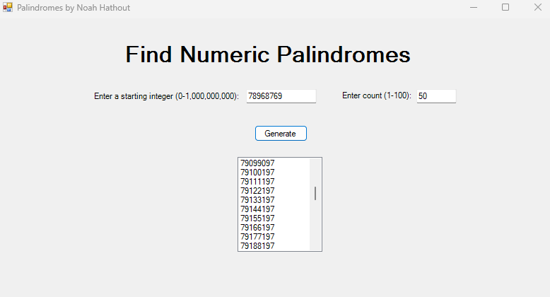

# WinForms-PalindromeGenerator

*A lightweight C# /.NET Windows Forms application for discovering numeric palindromes.*

## Overview
Type a **starting integer** (0 – 1 000 000 000) and a **count** (1 – 100), click **Generate**, and the app will display that many numeric palindromes beginning at—or after—the number you chose.

## Features
- **Fast generation** of up to 100 palindromes per query  
- **Input validation** with friendly error messages if values are out of range  
- **Resizable window** with clear instructions drawn directly onto the form  

## Getting Started

### Prerequisites
- Visual Studio 2022 (or later) with the **.NET Desktop Development** workload  
- .NET Framework 4.8 (or adjust the target to any compatible Windows Forms version)